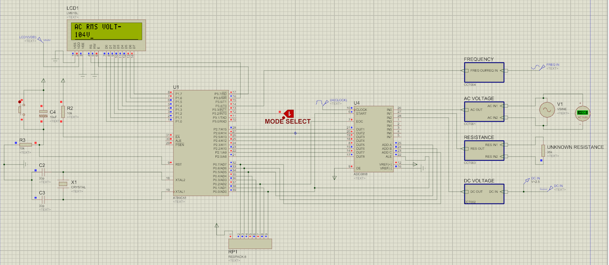
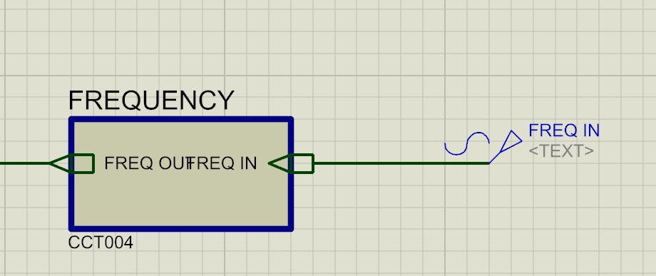
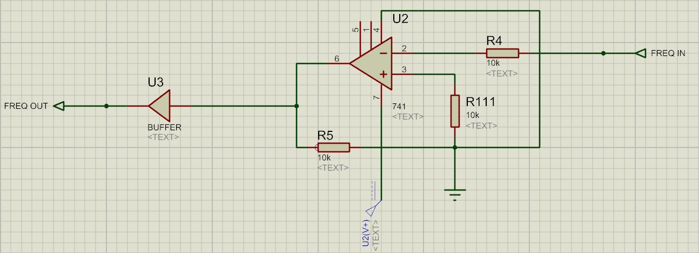
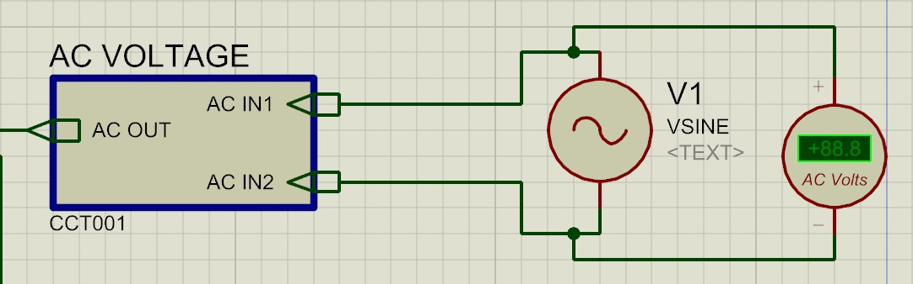
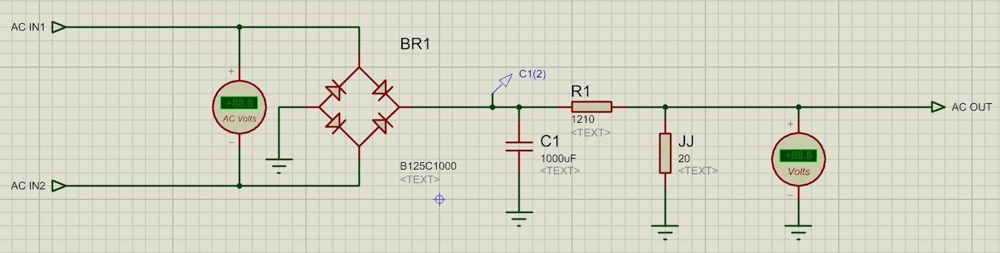
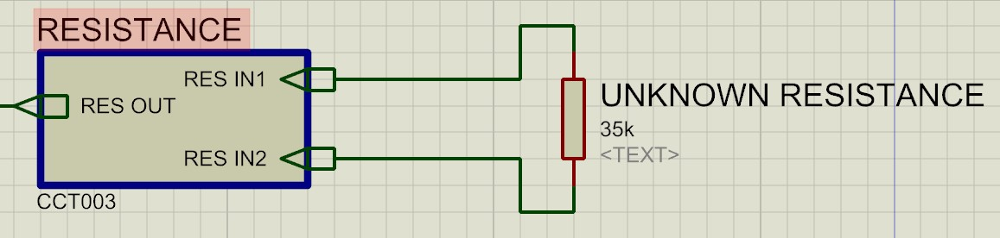
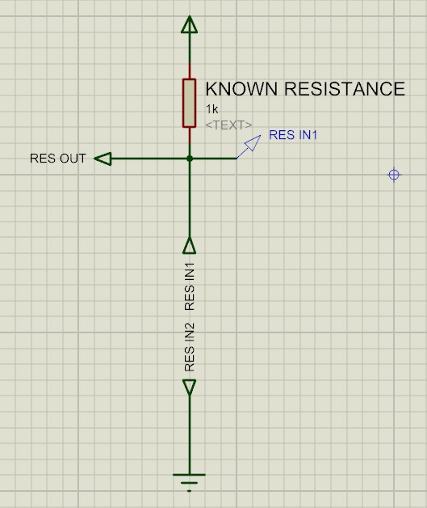
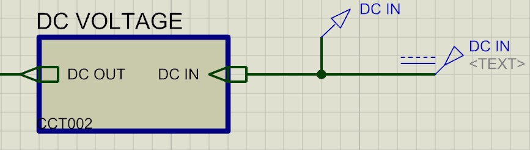

# 8051-uC-Based-Multimeter

  

A Group Project Report submitted by Project Team :  

 1. Bhushan Bhagwat Kolhe         bhushank1920@gmail.com  
 2. Harshal Rajesh Rathod         rathodharshal99@gmail.com  
 3. Cromwell Mendes               cromwellmendes16@gmail.com  
 4. Atharva Bondre                atharvabondre853@gmail.com  

Under the guidance of 
Mr. Yogesh Gholap

## Table of Contents

---  

- [Tasks](#tasks)  
  - [Frequency Meter](#1.-frequency-meter)  
  - [AC Voltage Meter](#2.-ac-voltage-meter)  
  - [Resistance](#3.-resistance)  
  - [DC Voltage](#4.-dc-voltage)
- [The Task Switching](#the-task-switching)
- [License](#license)

## Tasks

---

### 1. Frequency Meter  

  
  
*detailed circuit*  

The frequency measurement works by using the two timers/counters of the 8051. The circuit consists of a [zero crossing detector](https://circuitdigest.com/electronic-circuits/zero-crossing-detector-circuit-diagram). This helps convert non square wave signals into square wave signals. A buffer is added at the end since the output from the zero crossing detector is too low for the 8051 to detect.  

The frequency measurement is done by making the timer measure time and the counter measures the pulses from the zero crossing detector. The time period changes based on the overflow of the timer flag. This lets it measure frequencies from 1 Hz to 1 Mhz. Referred from this [research paper.](https://www.ijert.org/research/design-and-construction-of-an-autorange-digital-frequency-meter-using-a-microcontroller-IJERTV6IS110093.pdf)  

### 2. AC Voltage Meter  

  
  
*detailed circuit*  

The AC voltage meter consists of rectifier which converts an AC voltage in range from 0 to 220 V to DC voltage in range from 0 to 5 V. This is then given to the ADC and using appropriate conversion formula converted and displayed in RMS.  

### 3. Resistance

  
  
*detailed circuit*  

The resistance is measured by using a voltage divider network. The DC voltage is meastured and converted to resistance using appropriate conversion equation. Resistance below/equal to 1k can’t be measured. Because the numerator becomes smaller than the denominator, and result in fraction < 1. The program can show only integer values not the fraction. Thus, value above 1k to about 90k are shown with acceptable precision.  

### 4. DC Voltage  

The DC voltage is measured directly and displayed.  

## The Task Switching  

---

The switching is done using an interrupt based approach. On pressing the task switch button INT0 is used to switch immediately to other task. However this leads to the RETI issue since 8051 requires RETI to be issue to recognize further interrupts. When ‘RETI’ executes it reloads PC with contents of TOS. If SP = 9 then (PCH = 09h and PCL = 08h). So in the solution, at beginning of res, I have forced SP = 09h, and loaded a known dummy address on stack (09h = F0h and 08h =00h), which makes return address = F000h. After this, when I execute ‘RETI’, program return (goes) to address F000h, from where I jump back some safe place in res2, which I have labeled as ‘dummy_res_ret”. Thus, now after execution of ‘RETI’, the previous interrupt is truly completed and new interrupts can be recognized.  

## License

---

[GNU GPLv3](LICENSE.txt)